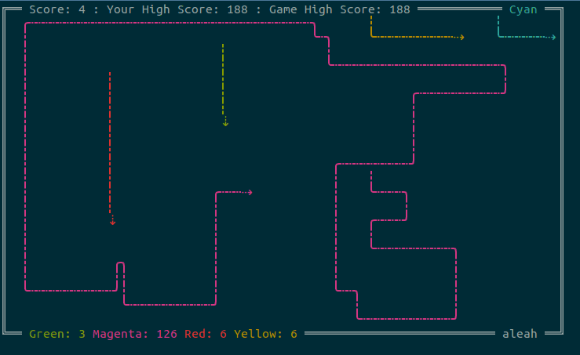

# Hack'n'ssh

Hack'n'ssh is a multiplayer lightcycle game that runs through SSH. It is a fork of [SSHTron](https://github.com/zachlatta/sshtron) by [Zach Latta](https://github.com/zachlatta).

To start playing:

    $ ssh insertAddressHere

_Controls: WASD or vim keybindings to move (**do not use your arrow keys**). Escape or Ctrl+C to exit._



To set your name:
    $ ssh [name]@insertAddressHere

## Running Your Own Copy

Clone the project and `cd` into its directory. These instructions assume that you have your `GOPATH` setup correctly.

```sh
# Create an RSA public/private keypair in the current directory for the server
# to use. Don't give it a passphrase.
$ ssh-keygen -t rsa -f id_rsa

# Download dependencies and compile the project
$ go get && go build

# Run it! You can set PORT to customize the HTTP port it serves on and SSH_PORT
# to customize the SSH port it serves on.
$ ./hacknssh
```

## License

Hack'n'ssh is licensed under the MIT License. See the full license text in [`LICENSE`](LICENSE).
